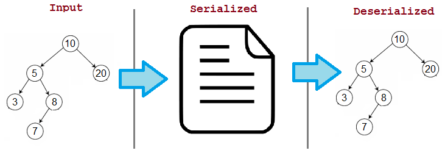

# 재귀 함수와 stringify 구현

## 재귀 함수

재귀 함수란 자기 자신을 호출하는 함수를 말한다.

알고리즘에서 재귀란 동일한 구조의 더 작은 문제로 나눌 수 있고 이를 통해 전체 문제를 해결하는 방법이다.

보통 중첩된 반복문이 많아 중첩 횟수를 예측하기 어렵거나, 변수 사용을 줄이기 위한 상황에서 재귀를 사용한다.

<br>

### 재귀함수 장점

- 반복문의 사용을 줄일 수 있어서 코드가 간결해지고 변수를 여러 개 사용하지 않아도 된다.

<br>

### 재귀함수 단점

- 코드의 흐름을 직관적으로 파악하기 어렵다.
- 지역변수, 매개변수, 반환값을 모두 stack에 저장하여 반복문에 비해 많은 메모리를 사용한다.
- 메서드 종료 이후 복귀를 위한 context switching 비용이 발생한다.

<br>

### 재귀함수 사용을 사용하려면?

- 문제를 작은 단위로 쪼갤 수 있어야 한다.
- 재귀 함수 탈출 조건이 존재해야한다.

<br>

### 재귀적 사고

1. 함수의 입력값과 출력값 정의하기
2. 가장 작은 단위로 문제를 쪼개기
3. 가장 작은 문제 해결하여 탈출 조건 구성하기 (Base Case)
4. 남아있는 복잡한 경우를 해결하기 (Recursive Case)

<br>

---

<br>

## JSON

JSON은 JavaScript Object Notation의 줄임말로 서로 다른 프로그램 사이에서 데이터의 교환을 위해 만들어진 객체 형태의 포맷이다.

데이터를 JSON 포맷의 문자열로 변환하는 과정을 직렬화(serialize), 문자열을 다시 JSON의 객체로 읽어오는 과정을 역직렬화(deserialize)라고 한다.



<br>

다음은 jackson에서 제공하는 ObjectMapper 클래스를 사용하여 직렬화, 역직렬화하는 과정을 나타낸 코드이다.

```java
// writeValueAsString으로 직렬화하는 과정
ObjectMapper mapper = new ObjectMapper();
String json = mapper.writeValueAsString(message);

System.out.println(json);

/* Output
{"createdAt":"2022-09-21,10:10:10","receiver":"받는이","sender":"보낸이","message":"뭐해?"}
*/
```

```java
// readValue로 역직렬화하는 과정
ObjectMapper mapper = new ObjectMapper();
String json = "{\"createdAt\":\"2022-09-21,10:10:10\",\"receiver\":\"받는이\",\"sender\":\"보낸이\",\"message\":\"뭐해?\"}";

Map<String, String> deserializedData = mapper.readValue(json, Map.class);
System.out.println(deserializedData);

/* Output
{createdAt=2022-09-21,10:10:10, receiver=받는이, sender=보낸이, message=뭐해?}
*/
```

<br>
<br>

## stringify() 구현

JSON은 트리 구조를 갖고 있기 때문에 재귀 탐색이 가능하다. 그래서 재귀를 이용하여 JSON 객체를 문자열로 변환해주는 `stringify` 메서드를 직접 구현해봤다. (위의 코드에서 `writeValueAsString()`)

```java
import com.fasterxml.jackson.core.JsonProcessingException;
import com.fasterxml.jackson.databind.ObjectMapper;

import java.util.*;

public class stringifyJSON {
  public String ObjectMapper(Object data) throws JsonProcessingException {
    ObjectMapper mapper = new ObjectMapper();
    return mapper.writeValueAsString(data);
  }

  public String stringify(Object data) {
    if (data instanceof String) {
      return String.format("\"%s\"", data);
    }
    else if (data instanceof Integer){
      return data.toString();
    }
    else if (data instanceof Boolean){
      return data.toString();
    }
    else if (data instanceof Object[]){
      Object[] arr = (Object[]) data;//다운 캐스팅

      if (arr.length==0) return "[]";

      String stringifyData = "";//문자열로 변환한 json 데이터

      for (int i=0;i<arr.length;i++) {
        stringifyData += stringify(arr[i]) + ",";
      }
      return String.format("[%s]",stringifyData.substring(0, stringifyData.length()-1));
    }
    else if (data instanceof HashMap<?,?>){
      HashMap<String, Object> map = (HashMap<String, Object>) data;
      String stringifyData = "";//"string"
      if (map.isEmpty()) return "{}";
      for (Map.Entry<String, Object> entry : map.entrySet()) {
        stringifyData+=stringify(entry.getKey())+":"+stringify(entry.getValue())+",";
      }
      return String.format("{%s}", stringifyData.substring(0, stringifyData.length()-1));
    }
    return "null";
  }
}
```
