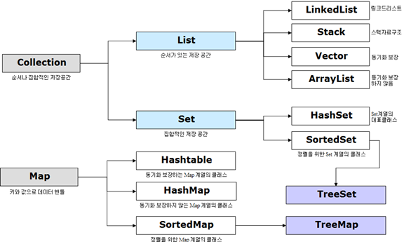

# 컬렉션 프레임워크의 구조



<br>
<br>
<br>

# 컬렉션 메서드

## 추가

- add(Object o): 객체 및 컬렉션의 객체들을 컬렉션에 추가
- addAll(Collection c): 객체 및 컬렉션의 객체들을 컬렉션에 추가

## 검색

- contains(Object o): 객체에 o가 저장되어 있는지 여부를 반환
- containsAll(Collection c): 컬렉션에 c가 저장되어 있는지 여부를 반환
- iterator(): 컬렉션의 iterator를 반환
- equals(Object o): 컬렉션이 동일한지 여부를 반환
- isEmpty(): 컬렉션이 비어있는지 여부를 반환
- size(): 저장된 전체 객체 수를 반환

## 삭제

- clear(): 저장된 모든 객체 삭제
- remove(Object o): 주어진 객체를 삭제하고 성공 여부를 반환
- removeAll(Collection c): 주어진 컬렉션을 삭제하고 성공 여부를 반환
- retainAll(Collection c): 주어진 컬렉션을 제외한 모든 객체를 컬렉션에서 삭제하고 컬렉션에 변화가 있는지 여부를 반환

## 변환

- toArray(): 컬렉션 객체들을 객체 배열(Object [])로 반환
- toArray(Object[] a): 주어진 배열에 컬렉션의 객체를 저장해서 반환

<br>
 <br>
 <br>

# List

List 인터페이스는 배열처럼 일렬로 늘어놓은 구조를 가지고 있다. 객체를 저장하면 인덱스가 생기고 인덱스로 객체를 관리한다.

 <br>
 <br>

## List 메서드

### 추가

- add(int index, Object element): index에 element를 추가
- addAll(int index, Collection c): index에 c를 추가, 리턴 타입은 boolean
- set(int index, Object element): inde에 element를 저장, 리턴 타입은 Object

### 검색

- get(int index): index에 저장된 객체를 반환, 리턴 타입은 Object

* indexOf(Object o), lastIndexOf(Object o): 순, 역방향으로 탐색하여 o의 인덱스 반환
* listIterator(), listIterator(int index): List를 탐색할 수 있는 iterator 반환
* subList(int fromIndex, int toIndex): fromIndex~toIndex 객체를 반환

### 삭제

- remove(int index): index의 객체를 삭제하고 삭제된 객체를 반환, 리턴 타입은 Object
- remove(Object o): o를 삭제, 리턴 타입은 boolean

### 정렬

- sort(Comparator c): 비교자(comparator)로 리스트 정렬

<br>
<br>

## ArrayList

List 인터페이스를 구현한 가장 많이 사용되는 클래스이다.

배열과 달리 저장공간이 초과되면 자동으로 늘어나며 순서가 유지된다는 특징을 갖는다.

ArrayList를 생성하기 위해서는 저장할 객체 타입을 타입 매개변수로 표기하고 기본 생성자를 호출한다.

```java
ArrayList<타입 매개변수> 객체명 = new ArrayList<타입 매개변수>(초기 저장 용량);
```

ArrayList는 데이터를 순차적으로 추가, 삭제하는 경우 유리하고 **인덱스를 통해 데이터에 접근**하기 때문에 검색이 빠르다는 장점이 있다.

하지만 중간에 위치한 데이터를 추가, 삭제하는 경우 데이터를 복사해서 이동하기 때문에 속도가 저하된다. 이런 경우 아래에 작성한 LinkedList를 사용하면 효율적이다.

<br>
<br>

## LinkedList

데이터가 **불연속적**으로 존재하며 이전 요소와 다음 요소의 주소값과 연결되어 있다.

따라서 **빈번한 데이터의 삭제나 삽입이 발생하는 곳**에서는 LinkedList의 처리 속도가 ArrayList보다 빠르다.

하지만 데이터 검색에 있어서는 시작 인덱스부터 찾고자 하는 데이터까지 순차적으로 각 데이터에 접근해야 하기 때문에 상대적으로 느린 속도를 가진다.

<br>
<br>
<br>
<br>

# Set

Set은 수학에서의 집합과 비슷하게 중복된 값을 허용하지 않으며 순서가 없다.

대표적인 클래스로는 HashSet, TreeSet이 있다

## Set 메서드

### 추가

- add(Object o): o를 추가하고 성공여부를 반환, 중복 객체면 false를 반환

### 검색

-contains(Object o): o가 Set에 존재하는지 여부를 반환
-isEmpty(): Set이 비어있는지 여부를 반환
-iterator(): Iterator를 반환
-size(): 전체 객체의 수를 반환

### 삭제

-clear(): 모든 객체를 삭제
-remove(Object o): o를 삭제하고 성공 여부를 반환

<br>
<br>
<br>
<br>

# Map

Map 인터페이스는 키(key)와 값(value)으로 구성된 Entry 객체를 저장하는 구조를 갖는다.

모든 key는 고유한 값을 가지며 key가 다르면 값이 같아도 다른 entry로 간주한다.

Map 인터페이스를 구현한 클래스로는 HashMap, Hashtable, TreeMap, SortedMap 등이 있다.

 <br>
 <br>

## Map 메서드

### 추가

- put(Object key, Object value): key가 새로운 키일 경우 값을 저장하고 null을 반환, 이미 존재하는 key일 경우 기존의 값을 value로 대체하고 기존의 값을 반환

### 검색

-containsKey(Object key): key가 존재하는지 여부를 반환
-containsValue(Object value): value가 존재하는지 여부를 반환
-entrySet(): 키, 값 쌍의 모든 Map.Entry 객체를 Set에 담아서 반환
-get(Object key): key에 해당하는 값을 반환
-isEmpty(): 비어있는지 여부를 반환
-keySet(): 모든 키를 Set에 담아서 반환
-size(): Entry 객체의 갯수를 반환
-values(): 저장된 모든 값을 Collection에 담아서 반환

### 삭제

-clear(): 모든 Map.Entry를 삭제
-remove(Object key): key와 일치하는 Map.Entry를 삭제하고 값을 반환

<br>
<br>

## HashMap

Map 인터페이스를 구현한 대표적인 클래스이다.

해시 함수를 통해 키와 값이 저장되는 위치를 결정하며 삽입되는 순서와 위치도 관계가 없다.

해싱을 사용하여 많은 양의 데이터를 검색할 때 효율적이다.

HashMap을 생성할 때에는 키와 값의 타입을 따로 지정해줘야 한다.

```java
HashMap<String, Integer> hashmap = new HashMap<>();
```

키와 값을 쌍으로 저장하기 때문에 `iterator()`를 직접 호출할 수 없고 `keySet()`이나 `entrySet()`을 통해 Set으로 변환한 후에 `iterator()`를 호출하여 데이터를 순회한다.
