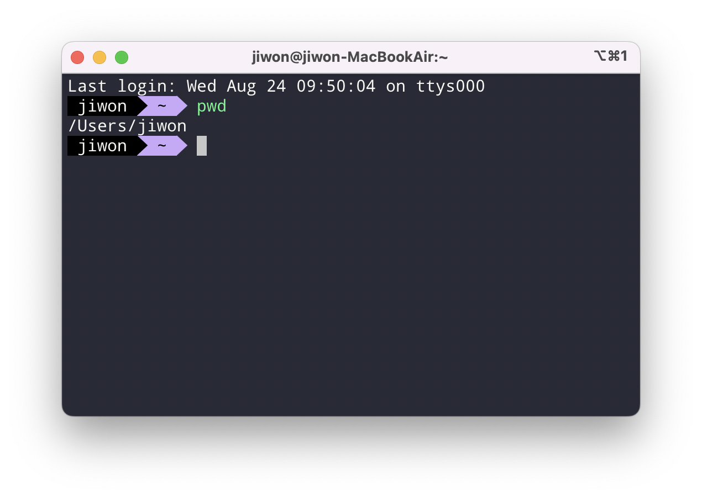
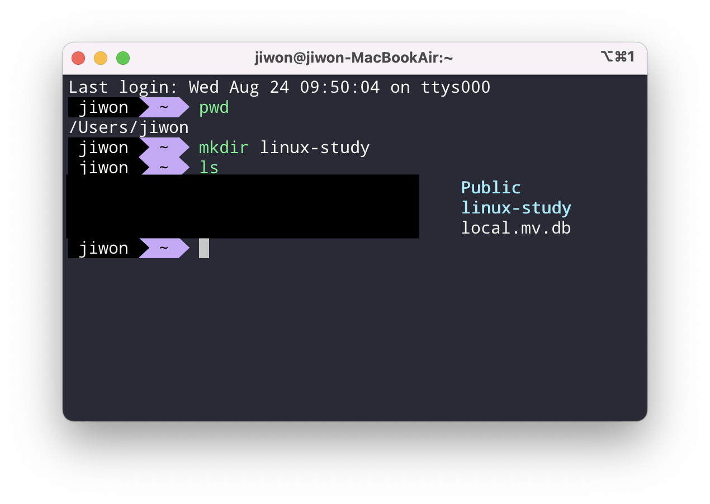
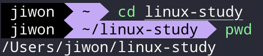
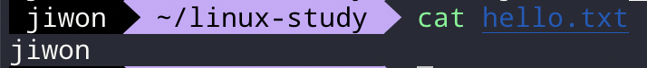
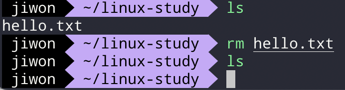

# CLI란?

CLI는 명령줄 인터페이스라는 뜻으로 명령어로 컴퓨터를 제어하는 방식을 말한다. GUI(그래픽 사용자 인터페이스)는 친숙한 인터페이스를 갖고 있고 사용자가 쉽게 컴퓨터를 제어할 수 있지만 그래픽에 컴퓨터 자원을 많이 사용하며 느리다는 단점을 갖고 있다. 따라서 프로그래밍을 하려면 높은 안정성과 빠른 속도를 가진 CLI에 익숙해져야 한다.

# CLI 기본 명령어

## pwd : 현재 위치 확인하기

현재 위치한 경로를 확인할 수 있다.


## mkdir : 새로운 폴더 생성하기

make directories의 약자로 폴더를 생성한다. 폴더 이름과 함께 입력해야 하며 공백으로 구분하여 입력한다.

만약 폴더/파일의 이름에 공백이 있으면 `\`를 사용한다.

```
mkdir linux-study
```

## ls : 특정 경로에 포함된 파일이나 폴더 확인하기

- `ls -l` : 폴더/파일의 포맷을 전부 출력
- `ls -a` : 숨어있는 폴더/파일을 포함하여 모든 항목을 출력
- `ls -al`, `ls-la`



mkdir 명령어로 만든 ‘linux-study’ 폴더가 만들어진 것을 확인할 수 있다.

## cd : 폴더로 이동하기

cd는 change directory로 다른 폴더로 이동할 수 있다. 내가 개발할 때 가장 많이 사용하게 되는 명령어다.

linux-study 폴더로 이동한 후 현재 위치를 확인했다.



## touch : 파일 생성하기

hello.txt 파일을 생성한다.

`touch hello.txt`

## echo : 공백 뒤의 내용 화면에 출력하기

`echo jiwon`

## > : 실행 결과를 파일로 저장하기

hello.txt 파일에 ‘jiwon’이 저장된다.


## cat : 파일 내용 출력하기



## rm : 폴더/파일 삭제하기

hello.txt 파일을 삭제했다.



만약 폴더를 삭제하려면 `rm -rf` 옵션을 사용해야 한다.

## mv : 폴더/파일의 이름, 위치 변경하기

이름을 변경하고 싶을 때에는 `mv [파일/폴더 원래 이름] [변경할 이름]`을 입력한다. 위치를 이동하고 싶을 때에는 `mv [이동할 파일 이름] [이동할 경로]`를 입력한다.

## cp : 폴더/파일 복사하기

파일 복사는 `cp [원래 파일 이름] [새로운 파일 이름]`

을 입력한다. 폴더 복사는 `rm` 명령어와 마찬가지로 `-rf` 속성을 이용한다. `cp -rf [원래 폴더 이름] [새로운 폴더 이름]`
